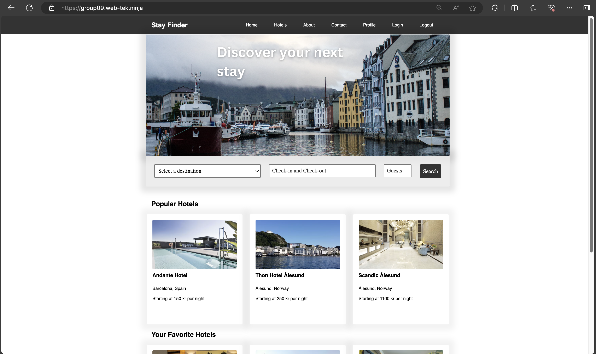
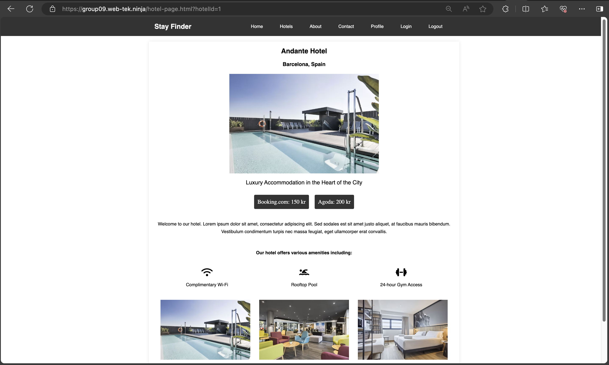

# WebTek-AppDev-2024-Group-9

## Used for group project and assignments in Webteknologi IDATA2301 and Applikasjonsutvikling IDATA2306

Stayfinder is a web application that helps users find hotels in different cities.
The application is built using Spring Boot, HTML, CSS and Javascript. 
The application uses API to fetch hotel data from the backend running on a server.
The backed stores data in a MySQL database.
The frontend is hosted using Nginx.

### How to run the application
To run the application on your computer:
1. Clone the repository
2. Open the project in an IDE.
3. Run the backend application.
5. Open a browser and go to `http://localhost:63342/WebTek-AppDev-2024-Group-9/Project/frontend/src/index.html`
6. The application should now be running.

**Note:** To run the application a .env file is needed. 
The .env file should contain the following:
```
DB_DRIVER=com.mysql.cj.jdbc.Driver
DB_URL=jdbc:mysql://localhost:3306/ + "YourDatabaseName"
DB_USERNAME= "YourUsername"
DB_PASSWORD= "YourPassword"
JWT_SECRET_KEY= "TheSecretKey"
```





### Sources to all the images can be found here:
- [Andante Hotel](https://athotel.com/hotels/39644942/Andante-Hotel?searchId=7872b140-ac6b-4ce1-b336-c287d8519178&checkin=02%2F18%2F2024&checkout=02%2F24%2F2024&rooms=%5B%5B2,%5B%5D%5D%5D)
- [Thon Hotel Ålesund](https://athotel.com/hotels/39638601/Thon-Hotel-%C3%85lesund?searchId=acbcdea4-a2d5-4800-b0e7-4149714b6271&checkin=02%2F18%2F2024&checkout=02%2F24%2F2024&rooms=%5B%5B2,%5B%5D%5D%5D)
- [Scandic Parken](https://athotel.com/hotels/39832113/Scandic-Parken?searchId=acbcdea4-a2d5-4800-b0e7-4149714b6271&checkin=02%2F18%2F2024&checkout=02%2F24%2F2024&rooms=%5B%5B2,%5B%5D%5D%5D)
- [Carlton Tower Hotel](https://athotel.com/hotels/39635435/Carlton-Tower-Hotel?searchId=893d2bac-32e4-41c4-93dc-06958acbd17b&checkin=02%2F18%2F2024&checkout=02%2F24%2F2024&rooms=%5B%5B2,%5B%5D%5D%5D)
- [Swissôtel Amsterdam](https://athotel.com/hotels/15488095/Swiss%C3%B4tel-Amsterdam?searchId=59c03ff8-4a3b-46f9-8839-3351223b3ccc&checkin=02%2F18%2F2024&checkout=02%2F24%2F2024&rooms=%5B%5B2,%5B%5D%5D%5D)
- [Hotel Homs](https://athotel.com/hotels/39690970/Hotel-Homs?searchId=1606753b-bd3b-4c37-af90-c33c13b868e5&checkin=02%2F18%2F2024&checkout=02%2F24%2F2024&rooms=%5B%5B2,%5B%5D%5D%5D)
- [Radisson Blu Atlantic Hotel, Stavanger](https://www.radissonhotels.com/no-no/hoteller/radisson-blu-stavanger-atlantic)
- [Clarion Hotel The Hub](https://no.hotels.com/ho137729/clarion-hotel-the-hub-oslo-norge/)
- [Grand Hotel Terminus, Bergen](https://www.booking.com/hotel/no/grand-terminus.no.html)
- [The Thief, Oslo](https://www.booking.com/hotel/no/the-thief.no.html)
- [Hotel Bristol, Oslo](https://www.booking.com/hotel/no/bristol.no.html)
- [Marina Bay Sands](https://www.booking.com/hotel/sg/marina-bay-sands.no.html)

### To complete the project we have used code from the following sources:
- AI-tools such as ChatGPT and GitHub Copilot
- https://github.com/strazdinsg/app-dev/
- Other learning materials from the course